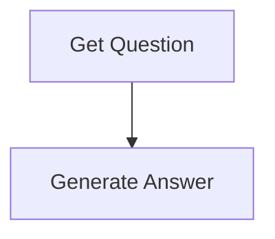
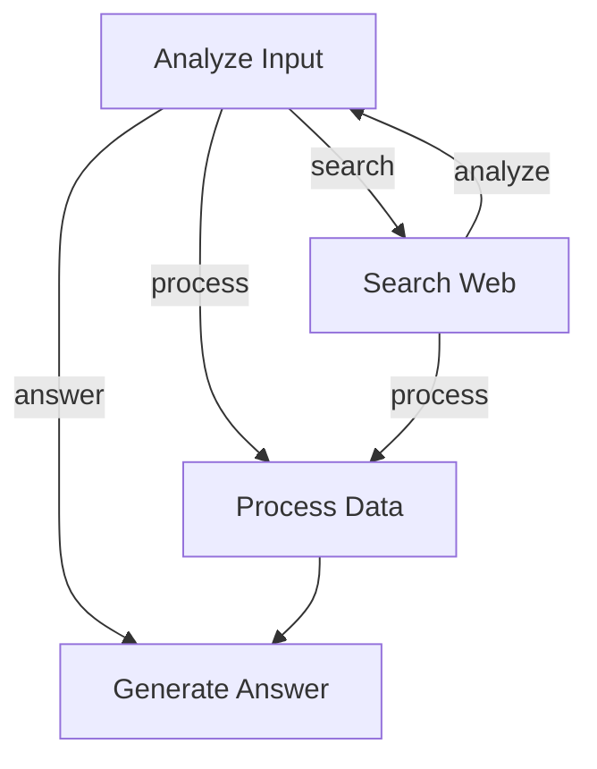
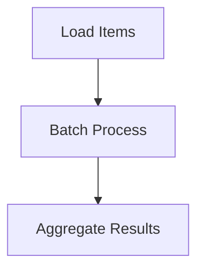

# Design Doc: Flyt Project Template

## Overview

This template provides a foundation for building LLM-powered applications using the Flyt workflow framework. It demonstrates three common patterns: Q&A flows, agent-based flows with decision making, and batch processing flows.

## Requirements

- Build modular, reusable workflows for LLM applications
- Support different execution patterns (sequential, conditional, batch)
- Provide clear separation between flow logic and node implementations
- Enable easy integration with various LLM providers
- Support both interactive and automated workflows

## Flow Design

### Applicable Design Patterns:

1. **Q&A Pattern**: Simple request-response flow for question answering
2. **Agent Pattern**: Decision-making flow with conditional routing
3. **Batch Processing Pattern**: Map-reduce style processing for multiple items
4. **Workflow Pattern**: Orchestration of multiple nodes with state management

### Flow High-Level Design:

#### 1. Q&A Flow
Simple linear flow for question answering:



#### 2. Agent Flow
Complex flow with decision making and loops:



#### 3. Batch Flow
Parallel processing flow for multiple items:



## Utility Functions

### 1. **Call LLM** (`utils/llm.go`)
   - *Input*: prompt (string), optional parameters (temperature, model, etc.)
   - *Output*: response (string)
   - Used by answer nodes and decision-making nodes

### 2. **Search Web** (`utils/search.go`)
   - *Input*: query (string)
   - *Output*: search results ([]SearchResult)
   - Used by search nodes for gathering information

### 3. **Process Text** (`utils/text.go`)
   - *Input*: text (string), operation (summarize, extract, etc.)
   - *Output*: processed text (string)
   - Used for text manipulation and analysis

## Node Design

### Shared Store Structure

The shared store is organized to support all flow types:

```go
shared = {
    // Common keys
    "question": "user's question",
    "answer": "generated answer",
    "context": "additional context",
    
    // Agent flow keys
    "search_results": []SearchResult,
    "decision": "next action to take",
    "iteration_count": 0,
    
    // Batch flow keys
    "items": []any,           // Items to process (uses flyt.KeyItems)
    "results": []any,         // Processing results (uses flyt.KeyResults)
    "final_results": "aggregated results",
    
    // Configuration
    "api_key": "LLM API key",
    "max_iterations": 5,
    "verbose": true,
}
```

### Node Implementations

#### 1. GetQuestionNode
- *Purpose*: Get user input interactively
- *Type*: Regular node
- *Steps*:
  - *prep*: None
  - *exec*: Read from stdin
  - *post*: Write "question" to shared store

#### 2. AnswerNode
- *Purpose*: Generate answer using LLM
- *Type*: Regular node with retry capability
- *Steps*:
  - *prep*: Read "question" and "context" from shared store
  - *exec*: Call LLM with formatted prompt
  - *post*: Write "answer" to shared store

#### 3. AnalyzeNode
- *Purpose*: Analyze current state and decide next action
- *Type*: Regular node
- *Steps*:
  - *prep*: Read current state from shared store
  - *exec*: Analyze and decide action (search/process/answer)
  - *post*: Return appropriate action

#### 4. SearchNode
- *Purpose*: Search for additional information
- *Type*: Regular node with retry
- *Steps*:
  - *prep*: Read "question" from shared store
  - *exec*: Perform web search
  - *post*: Write "search_results" and return "analyze"

#### 5. BatchProcessNode
- *Purpose*: Process multiple items concurrently
- *Type*: Batch node
- *Steps*:
  - *prep*: Read "items" from shared store
  - *exec*: Process each item (concurrent)
  - *post*: Write "results" to shared store

## Error Handling

1. **Node-level retries**: Configure retries for unreliable operations
2. **Fallback actions**: Define alternative paths on failure
3. **Context cancellation**: Respect context timeouts
4. **Validation**: Validate inputs in prep phase

## Extension Points

1. **Custom Nodes**: Add new nodes in `nodes.go`
2. **New Flows**: Define new flows in `flow.go`
3. **LLM Providers**: Extend `utils/llm.go` for different providers
4. **Data Sources**: Add loaders for different data sources
5. **Output Formats**: Customize result formatting

## Performance Considerations

1. **Concurrent Processing**: Use batch nodes for parallel work
2. **Caching**: Cache LLM responses when appropriate
3. **Rate Limiting**: Implement rate limiting for API calls
4. **Resource Management**: Clean up resources in post phase

## Security Considerations

1. **API Key Management**: Use environment variables
2. **Input Validation**: Sanitize user inputs
3. **Output Filtering**: Filter sensitive information
4. **Access Control**: Implement appropriate access controls